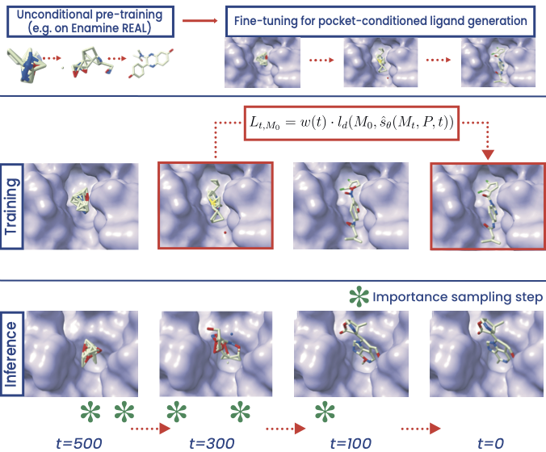

# PILOT: Equivariant diffusion for pocket conditioned de novo ligand generation with multi-objective guidance via importance sampling

[](https://doi.org/10.1039/D4SC03523B)

This is the official repository for PILOT - a model for guided structure-based drug discovery via equivariant (continuous and discrete) denoising diffusion. If you have any questions, feel free to reach out to us: [julian.cremer@pfizer.com](julian.cremer@pfizer.com), [tuan.le@pfizer.com](tuan.le@pfizer.com).


</details>


# Installation
Install the main environment via mamba
```bash
mamba env create -f environment.yml
```

For preparing pdbqt files, install a new environment
```bash
conda create -n mgltools -c bioconda mgltools
```

We also recommend installing a separate environment for running the docking
```bash
mamba env create -f environment_vina.yml
```

# Data

Activate the main environment
```bash
conda activate e3mol
```

## CrossDocked
Download the CrossDocked data as described in https://github.com/pengxingang/Pocket2Mol/tree/main/data

Create the CrossDocked data
```bash
python experiments/data/ligand/process_crossdocked.py --basedir /path/to/crossdocked_pocket10-folder --outdir /your/data/folder --no-H --dist-cutoff 7 
```

## Kinodata-3D
Download the Kinodata-3D dataset here (only kinodata_docked_with_rmsd.sdf.gz needed) https://zenodo.org/records/10410259

Create Kinodata-3D dataset
```bash
python experiments/data/ligand/process_kinodata.py --basedir /path/to/kinodata_folder --outdir /your/data/folder --no-H --dist-cutoff 5 
```

## PDBQT files for docking
Create the pdbqt files for the test complexes.

Activate the mgltools environment
```bash
conda activate mgltools
```

```bash
python experiments/docking_mgl.py path/to/test_dir /where/to/store/pdbqt_files dataset
```
(replace dataset with "crossdocked" or "kinodata")

# Training

Activate the main environment
```bash
conda activate e3mol
```

## Pocket-conditioned diffusion training

Train PILOT from scratch on CrossDocked
```bash
python experiments/run_train.py --conf configs/diffusion_crossdocked.yaml --save-dir /your/save/dir
```

Train PILOT from scratch on Kinodata-3D
```bash
python experiments/run_train.py --conf configs/diffusion_kinodata.yaml --save-dir /your/save/dir
```

# Sampling

## Model checkpoints

Model checkpoints go here!

## Test set (on multiple nodes using SLURM's job array)

Sample de novo ligands given the CrossDocked (Kinodata-3D) test set, the sampling can be started on multiple GPU nodes:

Modify scripts/generate_ligands_multi.sl (scripts/generate_ligands_multi_kinodata.sl):

    - num-gpus: Number of GPU nodes you want to use (number of test files divided by num-gpus)
    - model-path: Set the path to the trained model (normally save_dir/best_valid.ckpt)
    - save-dir: Where the sampled molecules as SDF files shall be saved
    - test-dir: Path to test directory containing .pdb, .sdf and .txt files
    - pdb-dir: Path to the pre-processed pdb files (see above: experiments/data/ligand/fetch_pdb_files.py)
    - dataset-root: Main path to the dataset
    - batch-size: Batch size (40-50 on a V100 GPU)
    - n-nodes-bias: The ligand sizes are sampled from the ligand size distribution extracted from the training data. With n-nodes-bias an additional number of atoms is added (for crossdocked: 10)
    - num-ligands-per-pocket-to-sample: 100 [default on CrossDocked 100]
    - num-ligands-per-pocket-to-save: 100 [default on CrossDocked 100]
    - max-sample-iter: 50 [max. number of iterations to fulfill num-ligands-per-pocket-to-sample]
    - n-nodes-bias: 0 [increase sampled/fixed ligand size by the number provided]
    - vary-n-nodes: [0, n-nodes-bias] is added randomly (uniform)
    - fix-n-nodes [whether or not to use the ground truth ligand size for number of atoms (hence no sampling of ligand sizes)]
    - prior-n-atoms: targetdiff [conditional or targetdiff - sample ligand size from pocket conditional ligand size distribution]
    - property-importance-sampling [whether or not to use property importance sampling]
    - property-importance-sampling-start: 200 [when on the diffusion trajectory to start importance sampling]
    - property-importance-sampling-end: 300 [when on the diffusion trajectory to end importance sampling]
    - property-every-importance-t: 5 [every n-th step perform importance sampling]
    - property-tau 0.1 [temperature for importance sampling]
    - sa-importance-sampling [whether or not to use SA importance sampling]
    - sa-importance-sampling-start: 0 [when on the diffusion trajectory to start importance sampling]
    - sa-importance-sampling-end: 300 [when on the diffusion trajectory to start importance sampling]
    - sa-every-importance-t: 5 [every n-th step perform importance sampling]
    - sa-tau: 0.1 [temperature for importance sampling]

```bash
sbatch scripts/generate_ligands_multi.sl
```

After sampling is finished, aggregate the results from all jobs to print the full evaluation
```bash
python experiments/aggregate_results.py --files-dir /your/sampling/save_dir
```

All ligands per target are saved in sdf files. The molecules in the sdf files contain all properties as well.

## Docking of generated ligands (on multiple nodes using SLURM's job array)

As soon ligands are generated for the respective pockets, we can start docking.

Modify scripts/docking_multi.sl (scripts/docking_multi_kinodata.sl):

    - num-cpus: Number of CPU nodes you want to use (number of generated sdf files divided by num-cpus; see IMPORTANT note below)
     -sdf-dir: Path to the generated ligands 
     -save-dir Path where all evaluations are saved at
     -pdbqt-dir Path where all pdbqt files are stored (see above: experiments/docking_mgl.py)
     -pdb-dir: Path to the pre-processed pdb files (see above: experiments/data/ligand/fetch_pdb_files.py)
     -dataset: Which dataset, e.g., crossdocked
     -docking-mode: vina_dock or qvina2 (default)

```bash
sbatch scripts/docking_multi.sl
```

After docking is finished, aggregate the results from all jobs to print the full evaluation
```bash
python experiments/aggregate_results.py --files-dir /your/docking/save_dir --docked --docking-mode qvina2
```


## Single PDB file

Activate the main environment
```bash
conda activate e3mol
```

In general, we assume a ground truth ligand docked to a protein, from which the binding site can be extracted. Otherwise the binding site must be found first.

To get all necessary files for sampling, run

```bash
python experiments/data/ligand/process_pdb.py --main-path /path/to/main_folder --pdb-id PDB_ID --ligand-id LIGAND_ID --no-H --dist-cutoff 7
```

Activate the mgltools environment and create the pdbqt file
```bash
conda activate mgltools
```

```bash
python experiments/docking_mgl.py path/to/pdb_dir /where/to/store/pdbqt_file dataset
```
(replace dataset with "pdb_file")


Then for sampling run

```bash
sbatch scripts/generate_ligands_multi_pdb_file.sl
```
(specify all arguments to your needs as before)


Afterwards, for docking run

```bash
sbatch scripts/docking_multi_pdb_file.sl
```
(again, specify the arguments; the docking mode can be set to "vina_dock", "vina_score", "qvina2". Default is "qvina2".)


## Acknowledgement
This study was partially funded by the European Union’s Horizon 2020 research and innovation programme under the Marie Skłodowska-Curie Actions grant agreement “Advanced machine learning for Innovative Drug Discovery (AIDD)” No. 956832.